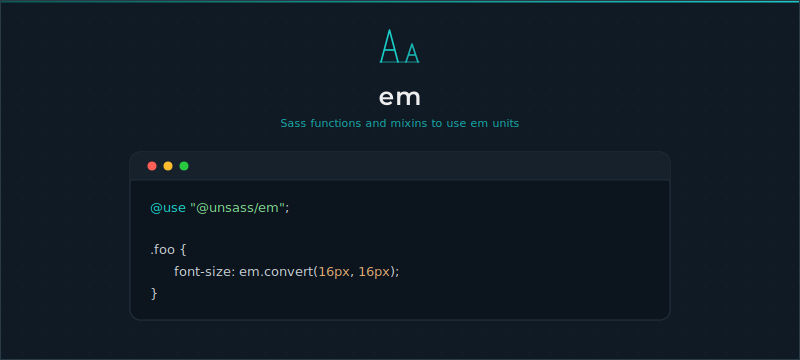

# Em

[](https://www.npmjs.com/package/@unsass/em)
[](https://www.npmjs.com/package/@unsass/em)
[](https://www.npmjs.com/package/@unsass/em)

## Introduction

A small Sass toolkit for working with `em` units. Convert one or many `px` values to `em` against a chosen context, and
emit ready-to-use declarations with concise, composable functions and mixins so relative sizing stays readable and
consistent.

<div align="center">



</div>

## Installing

```shell
npm install @unsass/em
```

## Usage

```scss
@use "@unsass/em";

.foo {
    font-size: em.convert(16px, 16px);
}
```

```css
.foo {
    font-size: 1em;
}
```

## Mixins

### `declaration($property, $value, $context, $important)`

Emits a declaration for `$property`, converting the `px` values of `$value` to `em` against `$context` (the base font
size, in `px`). Pass `$important: true` to append `!important`.

```scss
@use "@unsass/em";

.foo {
    @include em.declaration(font-size, 16px, 16px); // Single value.
    @include em.declaration(margin, 20px 30px, 16px); // Multiple values.
    @include em.declaration(border, 1px solid darkcyan, 16px); // Multiple mixed values.
    @include em.declaration(box-shadow, 0 0 10px 5px rgba(darkcyan, 0.75), inset 0 0 10px 5px rgba(darkcyan, 0.75), 16px); // Comma-separated values.
}
```

```css
.foo {
    font-size: 1em;
    margin: 1.25em 1.875em;
    border: 0.0625em solid darkcyan;
    box-shadow: 0 0 0.625em 0.3125em rgba(0, 139, 139, 0.75), inset 0 0 0.625em 0.3125em rgba(0, 139, 139, 0.75);
}
```

## Functions

### `convert($values…)`

Converts one or more `px` values to `em`. The **last** value in the list is the context (base font size, in `px`) used
for the calculation, and is not emitted. Non-numeric values pass through unchanged, so mixed and comma-separated values
are supported.

```scss
@use "@unsass/em";

.foo {
    font-size: em.convert(16px, 16px); // Single value.
    margin: em.convert(20px 30px, 16px); // Multiple values.
    border: em.convert(1px solid darkcyan, 16px); // Multiple mixed values.
    box-shadow: em.convert(0 0 10px 5px rgba(darkcyan, 0.75), inset 0 0 10px 5px rgba(darkcyan, 0.75), 16px); // Comma-separated values.
}
```

```css
.foo {
    font-size: 1em;
    margin: 1.25em 1.875em;
    border: 0.0625em solid darkcyan;
    box-shadow: 0 0 0.625em 0.3125em rgba(0, 139, 139, 0.75), inset 0 0 0.625em 0.3125em rgba(0, 139, 139, 0.75);
}
```
